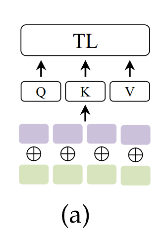

# Step da fare per finire il progetto

1. creo trasformer in pythorch
    - dataloader
    - modello
    - training
    - testing

2. creo modello multimodale
    - problema è gestire l'embedding di scalari, cioè dei dati di metilazione
    - usiamo embedding layer per trasformare vettori di dimensione n (sequenze e vattoei metilazione)in vettori nxd (d è la dimensione dell'embedding, aka il numero di id diversi che possono assumere i valori)
        - per fare questo dobbiamo creare un dizionario che mappa i valori possibili in un id
        - i valori sono n° di basi azotate (4) e almeno un id per la metilazione per un totale di 5 id nel vocabolario
        - unico dubbio una volta avuto questo embedding:
            - emdeddo seq e metilazione e poi sommo gli embedding?

    - altro modo e associare a 
        
        

Il modello definito dalla classe `projTransformer` è composto da vari blocchi e strati neurali, configurati in base ai parametri specificati durante l'inizializzazione. Ecco una panoramica del modello:

1. **Input Layer**:
   - L'input del modello può essere costituito da più tipi di dati, come sequenze di testo, sequenze di DNA, fattori di trascrizione, ecc.

2. **Embedding Layer**:
   - Se necessario, i dati di input vengono trasformati in uno spazio di embedding tramite un layer di embedding. L'embedding può essere ad esempio one-hot o basato su word2vec.

3. **Convolutional Layers** (Opzionale):
   - Se specificato, il modello può includere uno o più strati convoluzionali per elaborare le caratteristiche locali delle sequenze di input.

4. **Bert Block / Transformer Block**:
   - Il modello include uno o più blocchi di trasformazione (ad esempio, blocchi Bert o Transformer) per catturare le relazioni a lungo raggio nei dati di input. Ogni blocco può includere un'attenzione multi-testa seguita da uno strato di feedforward.

5. **Pooling Layer**:
   - Dopo l'elaborazione attraverso i blocchi di trasformazione, l'output può essere aggregato utilizzando un layer di pooling globale o un altro metodo di aggregazione.

6. **Altri Strati**:
   - Il modello può includere ulteriori strati densi e funzioni di attivazione per l'elaborazione finale delle caratteristiche estratte.

7. **Output Layer**:
   - L'output del modello può essere un singolo valore scalare (nel caso di un problema di regressione) o una distribuzione di probabilità (nel caso di un problema di classificazione).

8. **Modelli di Attenzione (Opzionale)**:
   - Se specificato, il modello può includere meccanismi di attenzione per evidenziare l'importanza delle diverse parti dell'input durante l'elaborazione.

9. **Modello Finale**:
   - Tutti i componenti sopra elencati vengono integrati per formare il modello finale, che viene compilato con l

'ottimizzatore e la funzione di perdita specificati durante l'inizializzazione.

10. **Configurazione e Addestramento**:
   - Dopo la definizione del modello, vengono configurati parametri aggiuntivi per l'addestramento, come ottimizzatori, funzioni di perdita, tassi di apprendimento, ecc. Il modello viene quindi addestrato utilizzando i dati di addestramento forniti.